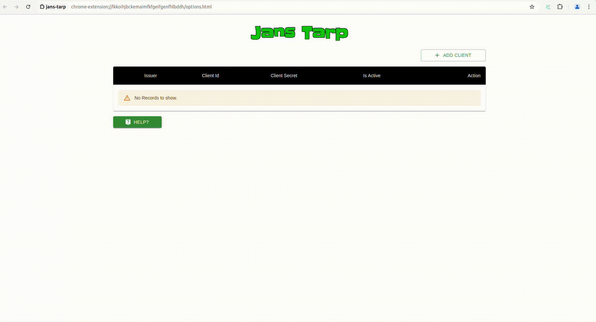

<p align="left">
  
</p>

[![Contributors][contributors-shield]](contributors-url)
[![Forks][forks-shield]](forks-url)
[![Stargazers][stars-shield]](stars-url)
[![Issues][issues-shield]](issues-url)
[![Apache License][license-shield]](license-url)


# About

This repo is home to Gluu Agama-PW project. This Agama project provides 
standard password authentication for a person.

## Where To Deploy

Project can be deployed to any IAM server that runs an implementation of 
the [Agama Framework](https://docs.jans.io/head/agama/introduction/).
Known implementations for Agama engine are listed below:

* Jans Auth Server
* Gluu Flex

## How To Deploy

### Download the Project

Project is bundled as [.gama package](https://docs.jans.io/head/agama/gama-format/). Visit the `Assets` section of the [Releases](https://github.com/GluuFederation/agama-pw/releases) to download the `.gama` package.

### Add The Project To The Server

Different IAM servers may provide different methods and 
user-interfaces from where an Agama project can be deployed on that server. 

Steps here show how Agama-PW project can be deployed on the [Janssen Server](https://jans.io). The Janssen Server provides multiple ways in which an Agama project can be deployed and configured. Use a command-line tool, or a REST API or a TUI (text-based UI). Refer to [Agama project configuration page](https://docs.jans.io/head/admin/config-guide/auth-server-config/agama-project-configuration/) in the Janssen Server documentation for more details.

### Configure The Project

Agama project accepts configuration parameters in JSON format. Every Agama 
project comes with a basic sample configuration file for reference.

Below is a typical agama-pw flow configuration:
  ```
        {
            "org.gluu.agama.pw.main": {
              "MAX_LOGIN_ATTEMPT": "6",
              "ENABLE_LOCK": "true",
              "LOCK_EXP_TIME": "180"
            }
        }
  ```
- MAX_LOGIN_ATTEMPT: Is the maximum failed login attempt before the user account is locked
- ENABLE_LOCK: true/false, this is use to enable the Account Lock feature
- LOCK_EXP_TIME: The time in seconds befor a locked account is unlock.

### Test The Flow

Use an Relying party implementation (like [jans-tarp](https://github.com/JanssenProject/jans/tree/main/demos/jans-tarp)) to send authentication request that triggers the flow.

From the incoming authentication request, the Janssen Server reads the `ACR` parameter value to identify which authentication method should be used. In order to invoke the Agama-PW project flow, specify the ACR value as that your request should be authenticated using Agama-PW project, use the ACR as `agama_<qualified-name-of-the-top-level-flow>`.  

The qualified name of the top level flow in Agama-PW project is `org.gluu.agama.pw.main`. So, use the ACR value as `agama_org.gluu.agama.pw.main`.

## Customize and Make It Your Own

Fork this repo and you can start customizing Agama-pw project in many ways. Starting from changing the main authentication flow to changing the styling of the web-pages to suite your organization's branding guidelines. Agama flow can also be used in conjunction with other Agama project to create complex authentication journeys. 

To make it easier to visualize and customize the Agama Project, use the [Agama Lab](https://cloud.gluu.org/agama-lab/login)

## Flow: One-step password authn

This is the classic combined username / password form authentication workflow.
The sequence diagram below shows the good flow.


[Source](https://sequencediagram.org/index.html#initialData=C4S2BsFMAIEEHMCGBbRBaACgdWgCUQA4ECe0AYuAPYDuAULYgMbCUBO0BkrAzpQHa0CiVqEYghfYNABGrGty61IksKWqRp3MJEHDR4xJOgBJACIZa0ygFc+AE2GlE14AAtloxMB2CuvPmgAfGYYAFzQxJDcHFCICgB0iSbQ1IZSLNBU8CACIUGy8lzh1iB2APQE1ORsyL48-Ply1Aqs4YyskHbclk0tQSHhGADyAMoAKtWstXmBzm4eIIxekOEAbojgpcsAFCV2ADQc1ACUDC7uKkve-ebhAN4ARB3c1uDAD6EPL4yMUdwP+wAOnwHoxKHZIB9oAAmAAMsKBIOQf0Q8Eh4QeQwA0g8AL60GYFZpFaBDTh8MzQMEQnqFVhBdSabRtDbgaRMADWQA)

### Login Flow

This flow was created using a pre-defined template located in the code folder. 
you can view code for the login flow. The image below illustrates 
the login flow:


The flow includes the UI for the login page, informational messages, 
service calls, and a validation loop.


In the `Web` folder, you can customize the UI of the page. Additionally, 
you can generate the code for this login flow by using the `Generate Code` button.


#### Exporting and Importing Login Flows

1. Export the Flow:

* Select the option to export the flow.
* A ZIP file containing your login flow configuration will be generated.
* Save this ZIP file to your local system for future use or sharing.

2. Importing a Login Flow:

* Navigate to the `web` section where you manage flows.
* Click on the `Import` button.
* Choose the ZIP file that you import.
* The system will process the file and import the flow configuration.
* Ensure that the imported flow is correctly integrated and functioning as intended.


### Uploading the Agama-pw Flow

To use the Agama-pw flow:

1. Download the login flow and upload it as an Agama project in Tui.
2. After uploading the flow, import the flow configuration.

You can also obtain a sample `Flow Configuration` by exporting it from Tui.


#### Flow Configuration

  
### Running the Agama Project

To run the flow, you need to [install the Tarp extension](https://github.com/JanssenProject/jans/tree/main/demos/jans-tarp). 
This extension is available for Chrome and Firefox.

After installing the Tarp extension, follow these steps:

1. Add the client by entering the hostname, client expiry date, and selecting the scopes.
The add client process as shown below



2. Once configured, the Authentication Flow Inputs screen will be displayed.
On this screen, add an `Acr Value` such as `agama_Qualified_Name`.
The authentication process is shown below.


The login screen should appear as shown in the image below:


### Verification

1. Verify the Login Flow: Ensure that the login flow operates as expected 
according to the designed process.
2. Check User Details: After successful login, verify if the user 
details are retrieved correctly.


# Core Developers

<table>
 <tr>
  <td align="center" style="word-wrap: break-word; width: 150.0; height: 150.0">
    <a href=https://github.com/syntrydy>
        
        <br />
        <sub style="font-size:14px"><b>Mougang Gasmyr</b></sub>
    </a>
  </td>
    <td align="center" style="word-wrap: break-word; width: 150.0; height: 150.0">
        <a href=https://github.com/mmrraju>
            
            <br />
            <sub style="font-size:14px"><b>Md Mostafejur Rahman</b></sub>
        </a>
  </td>
 </tr>
</table>

# License

This project is licensed under the [Apache 2.0](https://github.com/GluuFederation/agama-pw/blob/main/LICENSE)


<!-- This are stats url reference for this repository -->
[contributors-shield]: https://img.shields.io/github/contributors/GluuFederation/agama-pw.svg?style=for-the-badge
[contributors-url]: https://github.com/GluuFederation/agama-pw/graphs/contributors
[forks-shield]: https://img.shields.io/github/forks/GluuFederation/agama-pw.svg?style=for-the-badge
[forks-url]: https://github.com/GluuFederation/agama-pw/network/members
[stars-shield]: https://img.shields.io/github/stars/GluuFederation/agama-pw?style=for-the-badge
[stars-url]: https://github.com/GluuFederation/agama-pw/stargazers
[issues-shield]: https://img.shields.io/github/issues/GluuFederation/agama-pw.svg?style=for-the-badge
[issues-url]: https://github.com/GluuFederation/agama-pw/issues
[license-shield]: https://img.shields.io/github/license/GluuFederation/agama-pw.svg?style=for-the-badge
[license-url]: https://github.com/GluuFederation/agama-pw/blob/main/LICENSE
